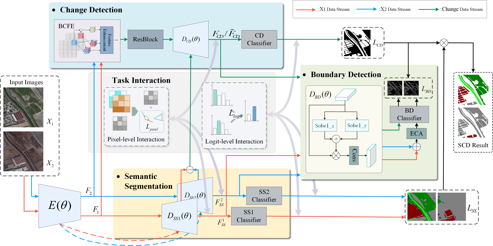

# TransSCD

## Transition Prototype Learning for Semantic Change Detection in Remote Sensing Images

> **TransSCD: Transition Prototype Learning for Semantic Change Detection in Remote Sensing Images**
>
> Xiangyu Jia, Zhibo Chen, Jushuang Qin, Zhenyao Wang, Xinpeng Zhang
>
> *ISPRS Journal of Photogrammetry and Remote Sensing*

[](https://creativecommons.org/licenses/by-nc/4.0/)

## Highlights

- **Transition Prototype Reasoning**: Explicitly models semantic transitions (e.g., *vegetation → building*) via a learnable prototype bank, replacing implicit late-fusion composition.
- **Soft Change Prior**: A lightweight branch that produces pixel-wise change probability maps to guide prototype matching with log-prior bias.
- **Region-Level Consistency Loss**: Encourages intra-transition feature compactness and inter-transition separability through contrastive prototype alignment.
- **Transition-Aware Composition**: Fuses timestamp-wise semantics, transition features, and soft priors into the final SCD prediction.

## Motivation

<p align="center">
  
</p>

Conventional SCD methods rely on late-fusion, where independent semantic predictions are composed with a binary change mask. This implicit transition inference is sensitive to pseudo-changes and lacks explicit transition modeling. **TransSCD** introduces a paradigm shift by constructing transition queries, matching them to a learnable prototype bank under soft change prior guidance, and composing the final SCD maps through transition-aware reasoning.

## Framework

<p align="center">
  
</p>

## Requirements

- Python 3.8+
- PyTorch 1.10+
- CUDA 11.0+

Install dependencies:

```bash
pip install -r requirements.txt
```

## Datasets

We evaluate TransSCD on three benchmark datasets:

| Dataset | Classes | Image Size | Train / Val / Test |
|---------|---------|------------|-------------------|
| [SECOND](https://captain-whu.github.io/SCD/) | 7 | 512×512 | 2968 / 847 / 847 |
| [Landsat-SCD](https://zenodo.org/record/5548643) | 5 | 416×416 | 2688 / 336 / 336 |
| [JL1H](https://github.com/) | 6 | 512×512 | 2400 / 300 / 300 |

### Dataset Structure

Each dataset should follow this directory structure:

```
<dataset_root>/
├── A/              # Time-1 images
├── B/              # Time-2 images
├── label1/         # Time-1 semantic labels
├── label2/         # Time-2 semantic labels
└── list/
    ├── train.txt
    ├── val.txt
    └── test.txt
```

For the JL1H dataset, subdirectories `im1/im2` are also supported in place of `A/B`.

### Data Preparation

For HRSCD dataset, we provide a preprocessing script to crop the 10000×10000 tiles into 256×256 patches:

```bash
python prepare_hrscd.py --src "path/to/HRSCD" --dst "./datasets/HRSCD_256"
```

For JL1H dataset, generate list files and compute normalization statistics:

```bash
python prepare_jl1.py --root "path/to/JL1"
```

## Training

```bash
# SECOND dataset
python train_SCD.py --dataname "SECOND" --datapath "path/to/SECOND" --num_classes 7

# Landsat-SCD dataset
python train_SCD.py --dataname "Landsat" --datapath "path/to/Landsat-SCD" --num_classes 5

# JL1H dataset
python train_SCD.py --dataname "JL1H" \
    --train_datapath "path/to/JL1/train" \
    --val_datapath "path/to/JL1/test" \
    --val_mode "test" --num_classes 6
```

### Key Training Parameters

| Parameter | Default | Description |
|-----------|---------|-------------|
| `--lr` | 3.5e-4 | Initial learning rate (AdamW) |
| `--weight_decay` | 1e-2 | Weight decay |
| `--epoch` | 100 | Training epochs |
| `--train_batchsize` | 2 | Batch size per GPU |
| `--accum_steps` | 8 | Gradient accumulation steps (effective batch = 16) |
| `--w_ss` | 1.0 | Semantic segmentation loss weight |
| `--w_prior` | 1.0 | Soft change prior loss weight |
| `--w_tr` | 1.0 | Transition classification loss weight |
| `--w_cons` | 0.1 | Region consistency loss weight |
| `--w_scd` | 1.0 | Final SCD loss weight |

## Evaluation

```bash
python test_SCD.py \
    --dataname "SECOND" \
    --datapath "path/to/SECOND" \
    --num_classes 7 \
    --ckptpath "path/to/checkpoint.pth"
```

## Visual Comparisons

### SECOND Dataset

<p align="center">
  
</p>

### JL1H Dataset

<p align="center">
  
</p>

### Landsat-SCD Dataset

<p align="center">
  
</p>

## Visualization

To generate per-sample visualizations with input images, ground truth, predictions, and the soft change prior map:

```bash
python visualize_inference.py \
    --dataname "SECOND" \
    --datapath "path/to/SECOND" \
    --ckptpath "path/to/checkpoint.pth" \
    --num_samples 20
```

## Project Structure

```
TransSCD/
├── models/
│   ├── TransSCD.py          # TransSCD model definition
│   ├── BTSCD.py             # BT-SCD baseline model
│   └── layers.py            # Shared building blocks
├── datasets/
│   ├── RS_ST.py             # Dataset loader (SECOND, Landsat, JL1H, HRSCD)
│   └── transform.py         # Data augmentation utilities
├── utils/
│   ├── loss.py              # Loss functions (TransSCDLoss, DiceLoss, etc.)
│   └── SCD_misc.py          # Metrics (Sek, Fscd, mIoU, confusion matrix)
├── train_SCD.py             # Training script
├── test_SCD.py              # Evaluation script
├── visualize_inference.py   # Visualization tool
├── inference_second.py      # Batch inference & save predictions
├── prepare_hrscd.py         # HRSCD data preprocessing
├── prepare_jl1.py           # JL1H data preprocessing
└── requirements.txt
```

## Citation

If you find this work useful, please consider citing:

```bibtex
@article{jia2025transscd,
  title={TransSCD: Transition Prototype Learning for Semantic Change Detection in Remote Sensing Images},
  author={Jia, Xiangyu and Chen, Zhibo and Qin, Jushuang and Wang, Zhenyao and Zhang, Xinpeng},
  journal={ISPRS Journal of Photogrammetry and Remote Sensing},
  year={2025}
}
```

## Acknowledgments

This codebase builds upon the following open-source projects:

- [torchvision](https://github.com/pytorch/vision) (ResNet-34 backbone)
- [tensorboardX](https://github.com/lanpa/tensorboardX) (training logging)

## License

This project is licensed under a [Creative Commons Attribution-NonCommercial 4.0 International License](https://creativecommons.org/licenses/by-nc/4.0/) for non-commercial use only.
