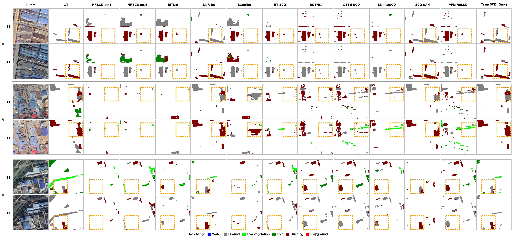
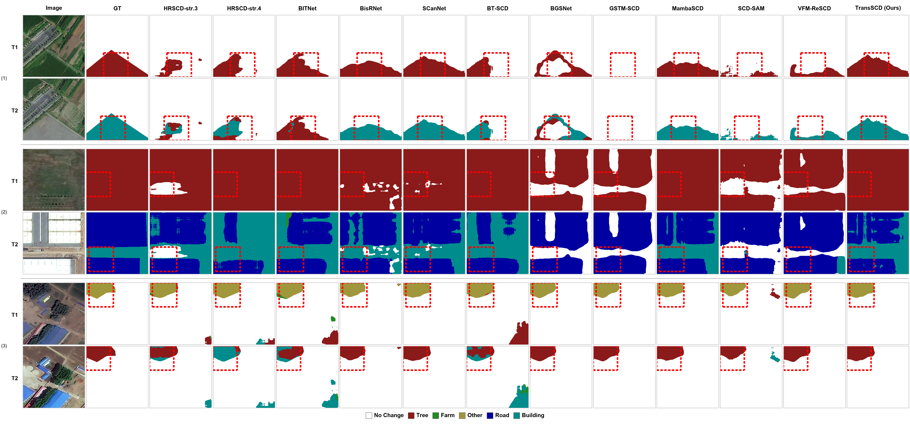

# TransSCD

Official PyTorch implementation of **TransSCD: Transition Prototype Learning for Semantic Change Detection in Remote Sensing Images**.

Xiangyu Jia, Zhibo Chen, Jushuang Qin, Zhenyao Wang, and Xinpeng Zhang

[](LICENSE)

## Overview

TransSCD is a semantic change detection framework for remote sensing images. It treats semantic transitions as explicit representation-level targets instead of deriving them only after timestamp-wise semantic prediction. The model learns class-specific transition prototypes, uses a soft change prior to guide prototype matching, and composes timestamp-wise semantic evidence with transition-aware features for final SCD prediction.

Key components:

- Transition query construction from bi-temporal semantic features.
- Class-specific transition prototype reasoning for changed transitions and class-specific unchanged patterns.
- Soft-prior guided prototype matching to reduce pseudo changes caused by appearance variation.
- Region-level query-space consistency regularization.
- Transition-aware composition for final semantic change prediction.

## Framework

<p align="center">
  
</p>

## Results Reported In The Manuscript

The following numbers are the TransSCD results reported in the submitted manuscript. Metrics are Overall Accuracy (OA), mean Intersection over Union (mIoU), Separated Kappa (SeK), and semantic change F-score (Fscd).

| Dataset | OA (%) | mIoU (%) | SeK (%) | Fscd (%) |
|---|---:|---:|---:|---:|
| SECOND | 88.86 | 75.05 | 25.95 | 65.65 |
| Landsat-SCD | 96.55 | 89.85 | 62.30 | 89.80 |
| JL1H | 89.05 | 78.97 | 41.94 | 79.77 |

At an input size of `512 x 512`, the model complexity reported in the manuscript is 22.73M parameters and 173.83 GFLOPs.

## Environment

The experiments in the manuscript were implemented in PyTorch and run on an NVIDIA RTX 4090-class GPU. A minimal environment is:

```bash
conda create -n transscd python=3.8 -y
conda activate transscd
pip install -r requirements.txt
```

Core dependencies:

- Python 3.8+
- PyTorch 1.10+
- torchvision 0.11+
- CUDA-capable GPU

The backbone uses ImageNet-pretrained ResNet-34 from `torchvision`. The first run may download the weights automatically; in offline environments, place the weights in the local Torch cache before running training or evaluation.

## Datasets

TransSCD is evaluated on SECOND, Landsat-SCD, and JL1H.

| Dataset | Classes in this code | Image size | Split used in the manuscript |
|---|---:|---:|---|
| SECOND | 7 | 512 x 512 | 2968 train / 847 val / 847 test |
| Landsat-SCD | 5 | 416 x 416 | 1455 train / 485 val / 485 test |
| JL1H | 6 | 256 x 256 | 4050 train / 1950 test |

Dataset links:

- SECOND: https://captain-whu.github.io/SCD/
- Landsat-SCD: https://zenodo.org/record/5548643
- JL1H: please follow the dataset provider's access policy.

Expected directory structure:

```text
<dataset_root>/
  A/                 # time-1 images, also supports im1/
  B/                 # time-2 images, also supports im2/
  label1/            # time-1 semantic labels, also supports labelA/ or label1_gray/
  label2/            # time-2 semantic labels, also supports labelB/ or label2_gray/
  list/
    train.txt
    val.txt
    test.txt
```

If `list/<split>.txt` is missing, the loader infers image IDs from the time-1 image directory. Labels may be either single-channel class-index maps or RGB color-coded maps using the dataset color map defined in `datasets/RS_ST.py`.

## Training

The default optimizer settings follow the submitted manuscript: AdamW, initial learning rate `3.5e-4`, weight decay `1e-3`, 100 epochs, batch size 2, cosine one-cycle learning rate schedule, and gradient accumulation with `--accum_steps 8` for an effective batch size of 16.

SECOND:

```bash
python train_SCD.py \
  --dataname SECOND \
  --datapath /path/to/SECOND \
  --num_classes 7
```

Landsat-SCD:

```bash
python train_SCD.py \
  --dataname Landsat \
  --datapath /path/to/Landsat-SCD \
  --num_classes 5
```

JL1H:

```bash
python train_SCD.py \
  --dataname JL1H \
  --train_datapath /path/to/JL1H/train \
  --val_datapath /path/to/JL1H/test \
  --val_mode test \
  --num_classes 6
```

Checkpoints are written to:

```text
checkpoints/<dataset>/<modelname>/run_XXXX/
```

For SECOND and Landsat-SCD, use the checkpoint with the best validation SeK. For JL1H, the manuscript follows the dataset protocol and evaluates the final checkpoint because there is no official validation split.

## Evaluation

```bash
python test_SCD.py \
  --dataname SECOND \
  --datapath /path/to/SECOND \
  --num_classes 7 \
  --ckptpath /path/to/checkpoint.pth
```

The evaluator reports `acc`, `mIoU`, `Sek`, `Fscd`, precision, and recall.

## Inference And Visualization

Batch inference for SECOND-style data:

```bash
python inference_second.py \
  --dataname SECOND \
  --datapath /path/to/SECOND \
  --ckptpath /path/to/checkpoint.pth
```

Per-sample visualization with inputs, labels, predictions, and soft change prior:

```bash
python visualize_inference.py \
  --dataname SECOND \
  --datapath /path/to/SECOND \
  --ckptpath /path/to/checkpoint.pth \
  --num_samples 20
```

## Qualitative Examples

SECOND:

<p align="center">
  
</p>

Landsat-SCD:

<p align="center">
  
</p>

JL1H:

<p align="center">
  
</p>

## Project Structure

```text
TransSCD/
  models/
    TransSCD.py          # TransSCD model definition
    BTSCD.py             # BT-SCD baseline implementation
    layers.py            # transition prototype reasoning and shared modules
  datasets/
    RS_ST.py             # dataset loader and dataset-specific color maps
    transform.py         # data augmentation utilities
  utils/
    loss.py              # TransSCDLoss and auxiliary losses
    SCD_misc.py          # confusion matrix and SCD metrics
  train_SCD.py           # training entry point
  test_SCD.py            # evaluation entry point
  inference_second.py    # batch inference and prediction export
  visualize_inference.py # qualitative visualization
  prepare_jl1.py         # JL1H list/statistics helper
  prepare_hrscd.py       # HRSCD preprocessing helper
```

## Reproducibility Notes

- Set `--seed 42` to follow the default manuscript setting.
- Training artifacts, checkpoints, logs, and prediction outputs are intentionally excluded from git by `.gitignore`.
- Public datasets must be downloaded from the original providers and used according to their licenses.
- Exact numerical results can vary slightly with GPU type, CUDA version, PyTorch version, and nondeterministic CUDA kernels.

## Citation

If this repository is useful for your research, please cite the paper. The citation metadata will be updated after the paper receives a final bibliographic record.

```bibtex
@article{jia2026transscd,
  title   = {TransSCD: Transition Prototype Learning for Semantic Change Detection in Remote Sensing Images},
  author  = {Jia, Xiangyu and Chen, Zhibo and Qin, Jushuang and Wang, Zhenyao and Zhang, Xinpeng},
  journal = {ISPRS Journal of Photogrammetry and Remote Sensing},
  year    = {2026}
}
```

## License

This repository is released for non-commercial research use under the Creative Commons Attribution-NonCommercial 4.0 International License. See `LICENSE` for details.
